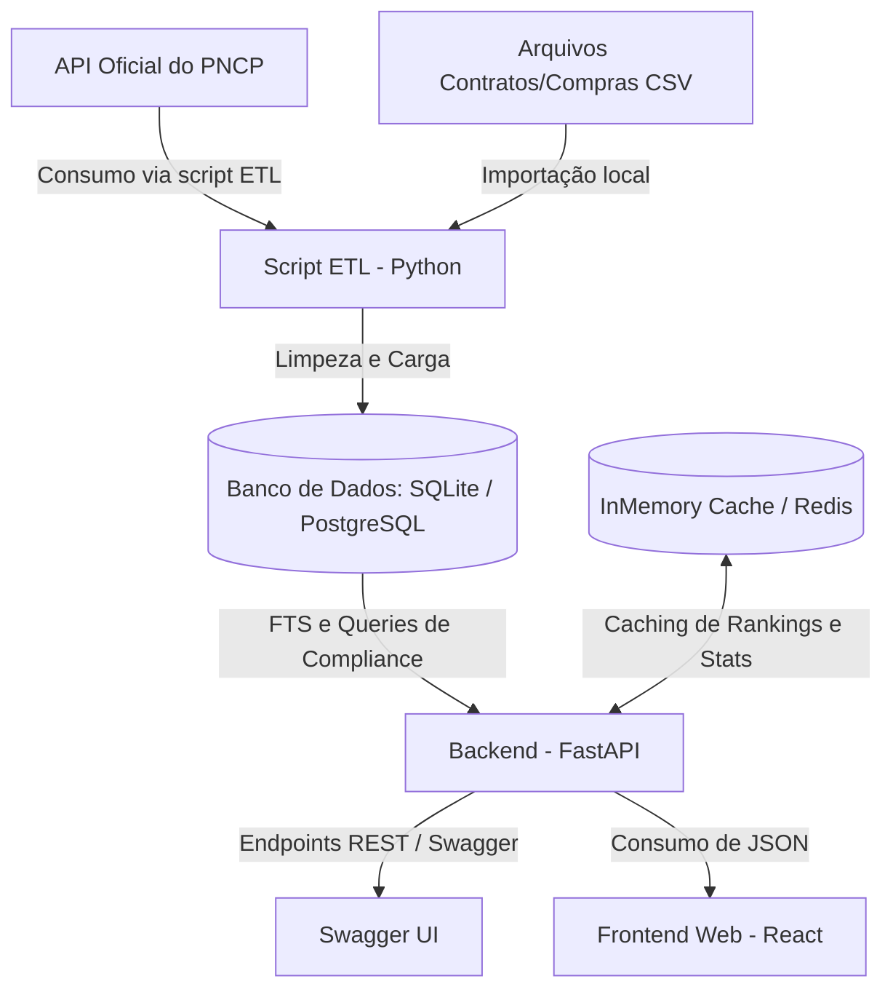

# 📊 OpenPNCP — Observatório de Licitações Públicas

[](https://www.python.org/)
[](https://fastapi.tiangolo.com/)
[](https://react.dev/)
[](https://vite.dev/)
[](https://www.docker.com/)
[](https://opensource.org/licenses/MIT)

O **OpenPNCP (Observatório de Licitações Públicas)** é um **projeto de estudo** e plataforma open-source desenvolvida para ingestão, análise e monitoramento inteligente de licitações públicas integradas ao **Portal Nacional de Contratações Públicas (PNCP)** do governo federal. 

O sistema coleta dados de contratações públicas, processa-os e disponibiliza um painel analítico interativo para acompanhamento social, auditoria de compliance e detecção de anomalias (como sobrepreço, prazos de edital atípicos ou indícios de direcionamento).

---

## 🗺️ Índice
1. [Destaques do Projeto](#-destaques-do-projeto)
2. [Arquitetura do Sistema](#-arquitetura-do-sistema)
3. [Stack Tecnológica](#-stack-tecnológica)
4. [Estrutura do Repositório](#-estrutura-do-repositório)
5. [Como Configurar e Rodar Localmente (Nativo)](#-como-configurar-e-rodar-localmente-nativo)
    - [Backend (FastAPI)](#backend-fastapi)
    - [Frontend (React + Vite)](#frontend-react--vite)
6. [Como Rodar com Docker (Recomendado)](#-como-rodar-com-docker-recomendado)
7. [Rotinas de Ingestão de Dados (ETL)](#-rotinas-de-ingestão-de-dados-etl)
8. [Detecção de Anomalias (Regras de Compliance)](#-detecção-de-anomalias-regras-de-compliance)
9. [Testes Automatizados](#-testes-automatizados)
10. [Roadmap do Projeto](#-roadmap-do-projeto)
11. [Documentação Auxiliar](#-documentação-auxiliar)

---

## ✨ Destaques do Projeto
* **Ingestão Automática:** Pipeline de ETL para coleta de licitações diretamente da API pública do PNCP e importação de bases em CSV.
* **Busca Full-Text Avançada:** Motor de busca integrado (FTS5 no SQLite local / GIN com `to_tsvector` no PostgreSQL de produção) para pesquisar termos rapidamente dentro do objeto e itens das licitações.
* **Detecção de Anomalias:** Funcionalidade que será implementada utilizando Inteligência Artificial (IA) para realizar análises profundas e identificar suspeitas de fraude ou irregularidade (prazos curtos, valores fora do padrão de mercado ou concentração atípica de fornecedores).
* **Caching de Alta Performance:** Camada de cache no backend para otimizar os endpoints analíticos e de rankings.
* **Interface Dinâmica:** Dashboard responsivo construído em React 19 exibindo gráficos de evolução mensal, painel de controle de riscos e ranking de órgãos e fornecedores.

---

## 🏛️ Arquitetura do Sistema

O fluxo de dados da aplicação funciona conforme a representação abaixo:



---

## 💻 Stack Tecnológica

### Backend & Ingestão
* **Linguagem:** Python 3.10+
* **Framework Web:** [FastAPI](backend/app/main.py) (Assíncrono, tipagem estática com Pydantic)
* **Banco de Dados:** SQLite (Desenvolvimento) / PostgreSQL (Produção)
* **ORM & Migrations:** SQLAlchemy 2.0+ & Alembic
* **Cache:** `fastapi-cache2` (InMemory e suporte a Redis)

### Frontend
* **Biblioteca:** React 19 (Componentização declarativa e Hooks)
* **Ferramenta de Build:** Vite (HMR ultra rápido)
* **Estilização:** CSS Vanilla de alta qualidade e responsividade
* **Gráficos & Visualização:** Recharts (Gráficos interativos de barras, linhas e pizza)
* **Ícones:** Lucide React

### DevOps & Qualidade
* **Containers:** Docker & Docker Compose
* **Testes Backend:** Pytest (com banco isolado in-memory)
* **Testes Frontend:** Vitest & React Testing Library
* **Linters:** Oxlint (Linter em Rust de alta velocidade para JS/React)

---

## 📁 Estrutura do Repositório

O projeto é organizado sob a estrutura de **monorepo**:

```text
openpncp/
├── backend/               # Código-fonte da API FastAPI e ETL
│   ├── app/               # Aplicação principal
│   │   ├── main.py        # Ponto de entrada da API
│   │   ├── api/           # Rotas da API REST (/licitacoes, /orgaos, /stats...)
│   │   ├── core/          # Configurações globais e de ambiente
│   │   ├── models/        # Modelos SQLAlchemy (tabelas do banco)
│   │   ├── schemas/       # Modelos Pydantic (validação de dados)
│   │   ├── crud/          # Lógica de persistência no banco
│   │   └── services/      # Regras de negócio e cálculos analíticos
│   ├── scripts/           # Scripts de ingestão (ingest.py, import_csv.py...)
│   ├── alembic/           # Arquivos de migração de banco
│   ├── tests/             # Testes automatizados do backend (Pytest)
│   ├── Dockerfile         # Dockerfile de produção do backend
│   └── requirements.txt   # Dependências Python
├── frontend/              # Interface Web em React (Vite)
│   ├── src/               # Código-fonte do frontend (Páginas, Componentes)
│   ├── public/            # Recursos estáticos
│   ├── Dockerfile         # Dockerfile de desenvolvimento/produção do frontend
│   └── package.json       # Dependências e scripts npm
├── csv/                   # Arquivos CSV auxiliares de dados governamentais
├── docs/                  # Documentações técnicas e estruturais
├── docker-compose.yml     # Orquestração local de containers
└── README.md              # Este arquivo de documentação
```

---

## 🚀 Como Configurar e Rodar Localmente (Nativo)

### Pré-requisitos
* Python 3.10 ou superior instalado
* Node.js v20.x ou superior com npm instalado

---

### Backend (FastAPI)

1. Navegue até o diretório do backend:
   ```bash
   cd backend
   ```

2. Crie e ative um ambiente virtual:
   ```bash
   # Windows (Powershell)
   python -m venv venv
   .\venv\Scripts\activate

   # Linux/macOS
   python3 -m venv venv
   source venv/bin/activate
   ```

3. Instale as dependências:
   ```bash
   pip install -r requirements.txt
   ```

4. Execute as migrações do banco de dados (Alembic) para criar a estrutura SQLite local:
   ```bash
   alembic upgrade head
   ```

5. Rode a rotina inicial de importação de dados para popular o banco local (veja mais na seção de [Ingestão de Dados](#-rotinas-de-ingestão-de-dados-etl)):
   ```bash
   python scripts/ingest.py --limit 100
   ```

6. Inicie o servidor FastAPI:
   ```bash
   uvicorn app.main:app --reload
   ```
   * A documentação interativa Swagger estará disponível em: `http://localhost:8000/docs`
   * A rota de verificação de status estará em: `http://localhost:8000/health`

---

### Frontend (React + Vite)

1. Abra um novo terminal e navegue para o diretório do frontend:
   ```bash
   cd frontend
   ```

2. Instale as dependências do projeto:
   ```bash
   npm install
   ```

3. Execute o servidor de desenvolvimento:
   ```bash
   npm run dev
   ```
   * O painel estará acessível no seu navegador em: `http://localhost:5173`

---

## 🐳 Como Rodar com Docker (Recomendado)

Você pode levantar toda a aplicação (API FastAPI + Frontend React) em containers isolados de forma rápida usando o Docker Compose.

1. Garanta que o Docker e Docker Compose estão instalados e rodando.
2. Na raiz do projeto, execute:
   ```bash
   docker-compose up --build
   ```
3. A estrutura local subirá automaticamente:
   * **Frontend:** `http://localhost:5173`
   * **Backend (API):** `http://localhost:8000`
   * **Swagger UI:** `http://localhost:8000/docs`

---

## 📥 Rotinas de Ingestão de Dados (ETL)

O projeto possui scripts dedicados para capturar e alimentar os bancos de dados localizados no diretório [backend/scripts/](backend/scripts/).

* **`ingest.py`**: O script principal de ETL. Ele realiza requisições para os endpoints de consulta pública do PNCP, baixa informações de órgãos, licitações, itens vinculados e seus anexos, salvando tudo no banco relacional após limpar os campos nulos e padronizar formatos de datas e valores.
  * **Modo de execução:**
    ```bash
    cd backend
    python scripts/ingest.py
    ```

* **`import_csv.py` / `import_contratos_csv.py`**: Utilizados para importar dados históricos consolidados que são disponibilizados publicamente em portais de dados abertos no formato `.csv`.
  * **Modo de execução:**
    ```bash
    python scripts/import_csv.py --file ../csv/compras_2025.csv
    ```

---

## ⚠️ Detecção de Anomalias (Análises com IA)

A detecção de anomalias e fraudes no **OpenPNCP** é uma funcionalidade planejada para ser implementada com o suporte de **Inteligência Artificial (IA)**. O motor baseado em IA realizará análises preditivas e heurísticas complexas diretamente sobre os dados coletados de licitações, fornecedores e contratos.

As análises automatizadas por IA focarão em sinalizar:

1. **Prazos Atípicos (Edital Relâmpago):** Detecção de licitações publicadas com prazos de recebimento de propostas excessivamente curtos (menos de **5 dias úteis**), dificultando a participação competitiva.
2. **Sobrepreço Estimado:** Análise semântica e estatística de itens de uso geral para identificar valores unitários estimados que superem em **3 vezes (300%)** a média histórica praticada.
3. **Concentração e Indícios de Direcionamento:** Mapeamento inteligente de padrões nos quais a mesma empresa (CNPJ) vença recorrentemente licitações em um mesmo órgão em um curto intervalo de tempo.

---

## 🧪 Testes Automatizados

### Backend (Pytest)
O backend possui uma suite de testes unitários e de integração abrangente usando SQLite in-memory para isolamento total da base de dados.
Para rodar a suite de testes:
```bash
cd backend
pytest tests/ -v
```

### Frontend (Vitest)
Para executar os testes de componentes do frontend React:
```bash
cd frontend
npm run test
```

---

## 🗺️ Roadmap do Projeto

* [x] **Fase 1: MVP & Base de Dados (V1)** — Ingestão do PNCP, armazenamento e busca Full Text integrada no SQLite local e PostgreSQL de produção.
* [x] **Fase 2: Expansão de Entidades & Performance (V2)** — Estruturação de fornecedores, contratos, regras SQL de compliance para anomalias e cache de alta performance com `fastapi-cache2`.
* [x] **Fase 3: Frontend e Painel de Alertas (V3)** — Desenvolvimento de dashboard React 19 integrado com gráficos, rankings de órgãos/estados/fornecedores e tela unificada para visualização de alertas.
* [ ] **Fase 4: Inteligência Artificial (V4)** — Integração com LLMs (OpenAI/Ollama) para leitura de PDFs e editais, buscando cláusulas suspeitas e gerando resumos técnicos estruturados de exigências.

---

## 📖 Documentação Auxiliar

Para entender detalhadamente o funcionamento técnico do projeto:
* [Projeto.md (Escopo e Modelo de Dados)](docs/Projeto.md)
* [API e Dicionário de Dados](docs/API.md) (Endpoints REST e Tabelas Relacionais)

---

Desenvolvido para fortalecer a transparência nas compras públicas brasileiras. 🇧🇷
