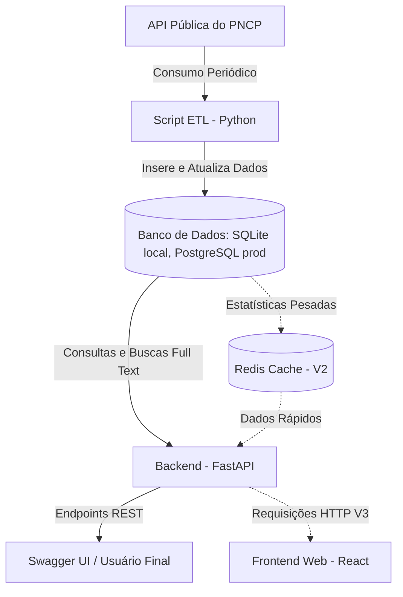

# Infraestrutura: Observatório de Licitações Públicas (OpenPNCP)

Este documento detalha as decisões e os componentes de infraestrutura do projeto, bem como a arquitetura do sistema desde o desenvolvimento local até a produção.

## 1. Arquitetura Geral do Sistema

Abaixo, a representação do fluxo de dados e dos serviços previstos no projeto.



## 2. Componentes e Tecnologias

### 2.1 Backend e API
* **Tecnologia Base:** Python 3.10+
* **Framework:** FastAPI (escolhido pela alta performance, tipagem estática e suporte nativo assíncrono).
* **Servidor ASGI:** Uvicorn.
* **Documentação:** Swagger/OpenAPI gerado automaticamente pelo FastAPI.

### 2.2 Banco de Dados e Modelagem
* **Tecnologia Base:** SQLite (Desenvolvimento) / PostgreSQL 15+ (Produção)
* **ORM:** SQLAlchemy (interação orientada a objetos com as tabelas).
* **Migrations:** Alembic (para versionamento do esquema do banco `orgaos`, `licitacoes`, etc).
* **Diferenciais:** Utilização de FTS5 no SQLite (Dev) e índices `GIN` e funções de busca textual (`to_tsvector`, `plainto_tsquery`) no PostgreSQL (Produção) para suportar buscas ágeis dentro de objetos e descrições das licitações.

### 2.3 Rotina de Ingestão de Dados (ETL)
* Um processo separado da API que roda em _background_ (podendo ser orquestrado por um `CronJob` na própria VPS ou ferramentas mais complexas no futuro).
* Existem múltiplos scripts no diretório `backend/scripts/` (ex: `ingest.py`, `import_compras_pncp.py`, `import_contratos_csv.py`) que fazem requisições às rotas do PNCP e importam CSVs, limpando e gravando os dados na base relacional.

---

## 3. Estrutura de Pastas do Projeto

A organização de diretórios do repositório seguirá o padrão **monorepo**, separando o backend, o futuro frontend e a documentação.

```text
openpncp/
├── backend/               # Código-fonte da API em FastAPI e ETL
│   ├── app/
│   │   ├── main.py        # Ponto de entrada da API FastAPI
│   │   ├── api/           # Endpoints REST (rotas)
│   │   ├── core/          # Configurações globais e de ambiente
│   │   ├── models/        # Modelos do SQLAlchemy (tabelas do banco)
│   │   ├── schemas/       # Modelos Pydantic (validação de I/O)
│   │   ├── crud/          # Lógica de banco de dados (Create, Read...)
│   │   └── services/      # Regras de negócio e rotinas pesadas
│   ├── scripts/           # Scripts ETL (consumo do PNCP e CSVs)
│   │   ├── ingest.py
│   │   ├── import_compras_pncp.py
│   │   └── import_contratos_csv.py
│   ├── alembic/           # Arquivos de migração do banco (Alembic)
│   ├── tests/             # Testes automatizados (Pytest)
│   ├── docker-compose.yml # Orquestração de containers local
│   ├── Dockerfile         # Imagem da aplicação para deploy
│   └── requirements.txt   # Dependências da aplicação em Python
├── frontend/              # Interface Web em React (Vite)
│   ├── src/               # Código-fonte do frontend
│   ├── public/            # Arquivos estáticos
│   └── package.json       # Dependências do frontend
├── docs/                  # Documentações estruturais do projeto
└── README.md              # Documentação de entrada (Raiz)
```

---

## 4. Ambiente de Desenvolvimento Local (Docker)

Todo o desenvolvimento local deve ser feito utilizando o Docker para isolar dependências e manter paridade com produção. 

**Exemplo de uso em Desenvolvimento Local**:

Como optamos por utilizar o SQLite localmente, **não é estritamente necessário subir um contêiner de banco de dados para o desenvolvimento**. 

* **Sem Docker (Rápido):** Basta rodar a aplicação nativamente usando `fastapi dev app/main.py`. O banco de dados será gerado na própria pasta (ex: `openpncp.db`).
* **Com Docker (Paridade com Prod):** Se desejar utilizar o Docker para executar a API, o `docker-compose.yml` será simplificado para iniciar apenas o Backend, e mapear um volume com o arquivo do SQLite.

```yaml
version: '3.8'

services:
  # Aplicação (FastAPI)
  api:
    build: 
      context: .
      dockerfile: Dockerfile
    command: uvicorn app.main:app --host 0.0.0.0 --port 8000 --reload
    volumes:
      - .:/app
    ports:
      - "8000:8000"
    environment:
      - DATABASE_URL=sqlite:///./openpncp.db
```

---

## 5. Deploy em Produção (VPS)

O deploy será realizado em uma Virtual Private Server (VPS), o que nos dá maior controle sobre os contêineres Docker e recursos do sistema operacional.

### 5.1 Serviços a serem provisionados na VPS:
1. **Banco de Dados (Database Service):** Instância de PostgreSQL rodando via contêiner Docker. A `DATABASE_URL` deverá ser configurada no arquivo `.env`.
2. **Serviço da API (Web Service):** O código será atualizado via repositório (ex: `git pull`) e os contêineres subirão utilizando o `docker-compose.yml` de produção e o `Dockerfile`.
3. **Rotina de CronJob:** Configurar uma rotina no próprio `cron` do Linux da VPS para executar o script `ingest.py`, alimentando a base de dados em intervalos regulares.

---

## 6. Evolução da Infraestrutura

Conforme o _roadmap_, a infraestrutura recebeu e receberá novos componentes gradativamente:

* **V2 (Performance):** Implementação de cache para acelerar os resultados de consultas frequentes e pesadas nos rankings/estatísticas.
* **V3 (Dashboard):** A aplicação **Frontend React** (`Vite`) já está incorporada no diretório `frontend/` consumindo a API. O deploy poderá utilizar Nginx na própria VPS para servir os estáticos.
* **V4 (IA):** Adicionar dependências para interagir com a API da **OpenAI**, ou integrar com **Ollama** caso se deseje uma solução de inteligência artificial open-source operando localmente no próprio container.
